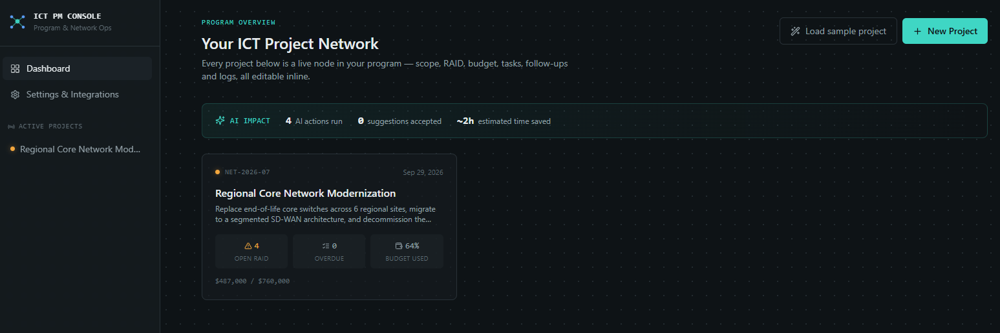
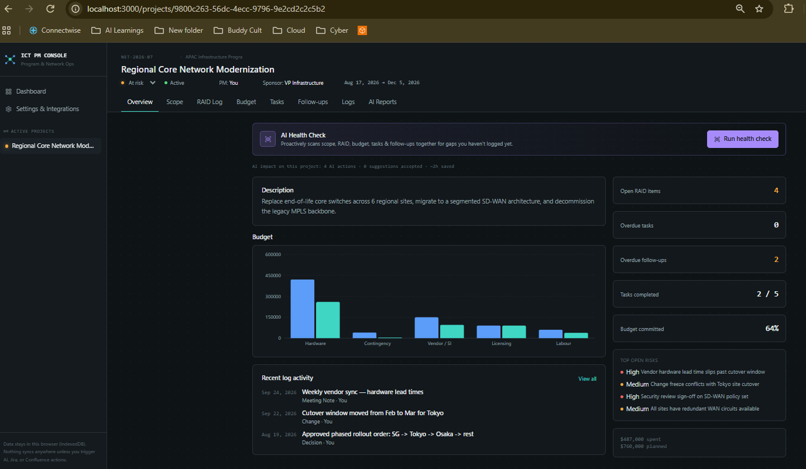
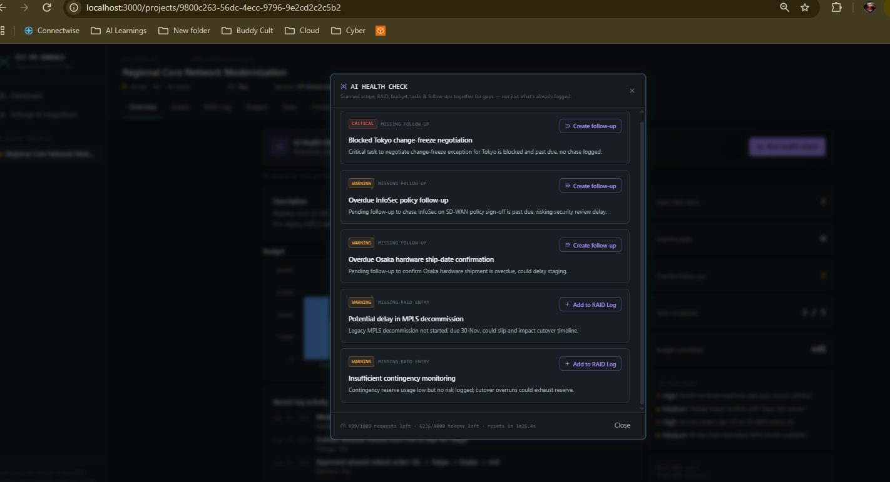
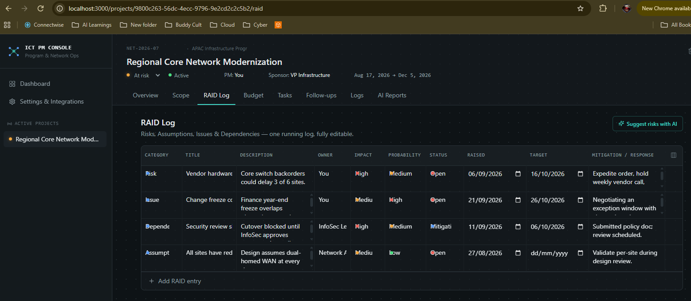
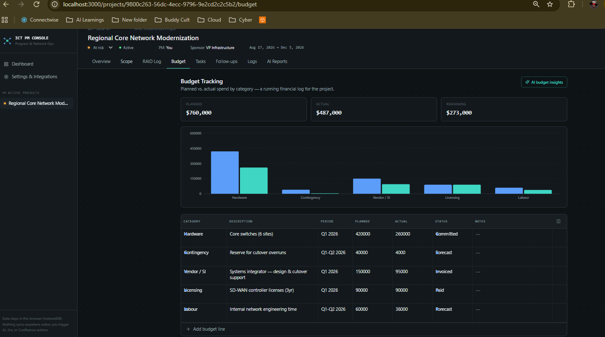
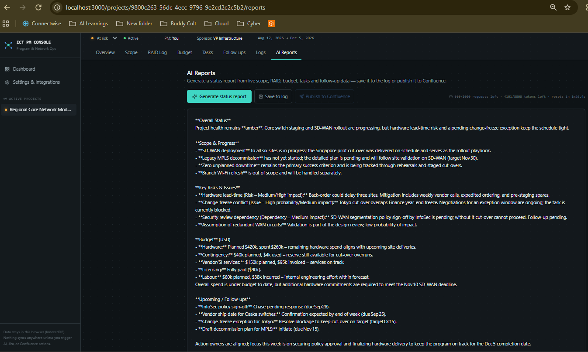

# ICT PM Console

An AI-assisted project & program management console purpose-built for ICT project and program management networks — RAID logs, scope, budget tracking, tasks, task-linked follow-ups, and change/decision logs, all fully editable, with one-click AI status reports and native Jira / Confluence sync.

Built with Next.js 14, TypeScript, Tailwind CSS, and IndexedDB (via Dexie) for fully local, zero-backend data storage — your project data never leaves your browser unless you explicitly trigger an AI, Jira, or Confluence action.

## Screenshots


*All projects at a glance — health status, open risks, overdue tasks, budget burn, and AI Impact stats.*


*The AI Health Check banner cross-references scope, RAID, budget, tasks and follow-ups for gaps.*


*Structured findings with one-click "Add to RAID Log" / "Create follow-up" actions.*


*Risks, Assumptions, Issues and Dependencies — fully editable, with custom columns.*


*Planned vs. actual spend by category, with a live chart.*


*Executive-ready status report generated from live project data.*

## What makes this different from a generic tracker

Most project dashboards are static forms with an "AI summarize" button bolted on. This one is built around **AI as a governance layer that acts, not just answers**:

- **AI Health Check** (project overview) — proactively cross-references scope, RAID, budget, tasks and follow-ups *together* to surface gaps you haven't logged yet (a blocked critical task with no matching RAID entry, a budget category trending over plan with no risk logged, an overdue item with no chase). This is the difference between an AI you ask a question and an AI that reviews your project the way you would before a steering committee.
- **Structured, actionable AI output** — RAID and budget AI responses aren't a paragraph you read and manually retype. Each suggestion is a card with a one-click "Add to RAID Log" / "Create follow-up" button that writes a real, structured row into your tracker.
- **AI Impact tracking** — every accepted AI suggestion is logged, and the dashboard surfaces a running total: AI actions run, suggestions accepted, and estimated hours saved. It's a real, growing number, not a claim.
- **Privacy-first by design** — all project data lives in this browser's IndexedDB. Nothing reaches an AI provider until you explicitly click a button, and only that specific payload goes out. No background sync, no third-party storage of your delivery data.

## Features

- **Multi-project dashboard** — health status, open-risk count, overdue tasks, budget burn, and cumulative AI impact at a glance across every project.
- **Scope** — objectives, deliverables, milestones and exclusions.
- **RAID Log** — Risks, Assumptions, Issues, Dependencies with impact/probability/status, owners and mitigation plans.
- **Budget tracking** — planned vs. actual by category, with a live chart and variance summary.
- **Tasks** — status/priority/assignee/due date, with two-way Jira sync (pull issues in, push new tasks out).
- **Follow-ups** — action items and check-ins, optionally linked back to a specific task.
- **Logs** — a chronological record of decisions, changes, meeting notes and AI-generated reports.
- **Fully dynamic sections** — every table supports inline add/edit/delete, and you can add a custom column to any section at runtime (e.g. add a "Vendor" column to Budget, or a "Regulatory Ref" column to RAID) without touching code.
- **AI Health Check** — a proactive, cross-section scan (see above) with one-click "Add to RAID Log" / "Create follow-up" actions per finding.
- **AI risk suggestions & budget insights** — structured, actionable suggestion cards on the RAID and Budget tabs, not prose.
- **AI status reports** — one click generates an executive-ready status report from live scope/RAID/budget/task/follow-up data, which you can save to the project log or publish straight to a Confluence page.
- **AI Impact stats** — dashboard and per-project totals for AI actions run, suggestions accepted, and estimated time saved.
- **Jira & Confluence integration** — configure once in Settings; sync tasks with a Jira project, publish AI reports to a Confluence space.

## Tech stack

- **Framework:** Next.js 14 (App Router) + TypeScript
- **Styling:** Tailwind CSS, custom design tokens (see `tailwind.config.ts`)
- **Local data:** IndexedDB via Dexie.js — no database or backend to host
- **AI:** [Groq](https://console.groq.com) free-tier API (OpenAI-compatible chat completions, Llama 3.3 70B by default), called from Next.js server routes so your API key never reaches the browser
- **Integrations:** Jira Cloud REST API v3, Confluence Cloud REST API — proxied through server routes using credentials stored in browser `localStorage`
- **Charts:** Recharts

## Getting started

```bash
npm install
cp .env.example .env.local   # then add your GROQ_API_KEY
npm run dev
```

Open [http://localhost:3000](http://localhost:3000). Click **"Load sample project"** on the dashboard to see a fully populated example (RAID log, budget, tasks, follow-ups, logs) in seconds.

### AI features (free — no credit card)

1. Get a free key at [console.groq.com/keys](https://console.groq.com/keys).
2. Add it to `.env.local`:

```
GROQ_API_KEY=gsk_xxxxxxxxxxxxxxxxxxxx
GROQ_MODEL=llama-3.3-70b-versatile   # optional, this is the default
```

The key is read only by server-side API routes (`app/api/ai/*`) and is never sent to the browser. Test connectivity any time from **Settings → Groq API → Test connection** — it also shows your current free-tier quota.

**About the free tier:** Groq's free tier doesn't expire — it's gated by rolling rate limits (requests/minute, requests/day, tokens/minute, tokens/day), not a credit balance that runs out. Every AI response in this app surfaces the remaining quota (from Groq's rate-limit response headers) next to the result, and if you ever do hit the limit, the app shows a friendly "try again in Xs" message instead of a raw error. For this app's usage pattern (occasional risk suggestions, one status report at a time) you're very unlikely to hit it in normal use.

### Jira integration

1. Create an API token at `id.atlassian.com` → Security → API tokens.
2. In the app, go to **Settings → Jira** and enter your Jira base URL (e.g. `https://yourorg.atlassian.net`), project key, account email, and API token.
3. On any project's **Tasks** tab, use **Pull from Jira** to import open issues as tasks, or **Push new tasks** to create Jira issues from tasks that don't have a Jira key yet.

### Confluence integration

1. Use the same (or a separate) API token as above.
2. In **Settings → Confluence**, enter your Confluence base URL (e.g. `https://yourorg.atlassian.net/wiki`), space key, account email, and API token.
3. On a project's **AI Reports** tab, generate a report and click **Publish to Confluence** to create a page in that space.

Credentials are stored only in this browser's `localStorage` and are sent directly to the matching server route (`app/api/jira/*`, `app/api/confluence/*`) only when you trigger a sync/publish action — they're never bundled into client-side JS or committed to the repo.

## Data & privacy

All project data (scope, RAID, budget, tasks, follow-ups, logs) is stored in **IndexedDB in your browser**, scoped to this app's origin. There is no database, no backend, and nothing is uploaded anywhere by default. This makes the app:

- Free to run — no hosting cost beyond wherever you deploy the static/Node app itself.
- Private by default — your project data isn't sent to any third party except when you explicitly trigger an AI, Jira, or Confluence call.
- Per-browser — data doesn't sync across devices. If you need that, point Dexie at a hosted backend or swap in Confluence/Jira as your source of truth.

## Project structure

```
app/
  page.tsx                  Dashboard (all projects)
  settings/page.tsx         Jira / Confluence / AI settings
  projects/[id]/
    layout.tsx               Project header + tab navigation
    page.tsx                 Project overview
    scope/page.tsx
    raid/page.tsx
    budget/page.tsx
    tasks/page.tsx
    followups/page.tsx
    logs/page.tsx
    reports/page.tsx         AI status report generator + Confluence publish
  api/
    ai/{suggest-risks,summarize,budget-insights}/route.ts
    jira/{issues,push}/route.ts
    confluence/publish/route.ts
components/
  DynamicTable.tsx           Generic editable table + custom-column support, used by every section
  Sidebar.tsx, StatusDot.tsx, BudgetChart.tsx, SectionHeader.tsx, AIResultModal.tsx, QuotaBadge.tsx, NewProjectModal.tsx
lib/
  db.ts                      Dexie (IndexedDB) schema
  types.ts                   Shared data model
  useBoard.ts                Generic CRUD + custom-column hook shared by every section
  useSettings.ts             localStorage-backed integration settings
  aiServer.ts                Server-side Groq client + rate-limit parsing
  seed.ts                    Demo data generator
```

## Deploying

Any Node-capable host works (Vercel, Render, a self-hosted Node server, etc.) since the app needs server routes for AI/Jira/Confluence calls — a pure static export won't support those. On Vercel:

```bash
vercel
```

Set `GROQ_API_KEY` (and optionally `GROQ_MODEL`) as environment variables in your hosting provider's dashboard. Jira/Confluence credentials are entered per-browser in Settings, so they don't need to be set as environment variables.

**If you're sharing this as a portfolio piece:** deploy it once with your own free Groq key set as a server env var, then link the live URL on your resume/GitHub README. That way anyone checking it out just clicks and it works — no setup, no key of their own needed. (Relying on a locally-run AI provider instead would mean the demo only works on your own machine.)

## Roadmap ideas

- Multi-user / shared backend (swap Dexie for a hosted Postgres + auth)
- Confluence page templates matching your organization's status-report format
- Jira status-mapping config (map Jira workflow statuses to this app's status vocabulary)
- Export project data to Excel/CSV
- Gantt-style scope/timeline view
